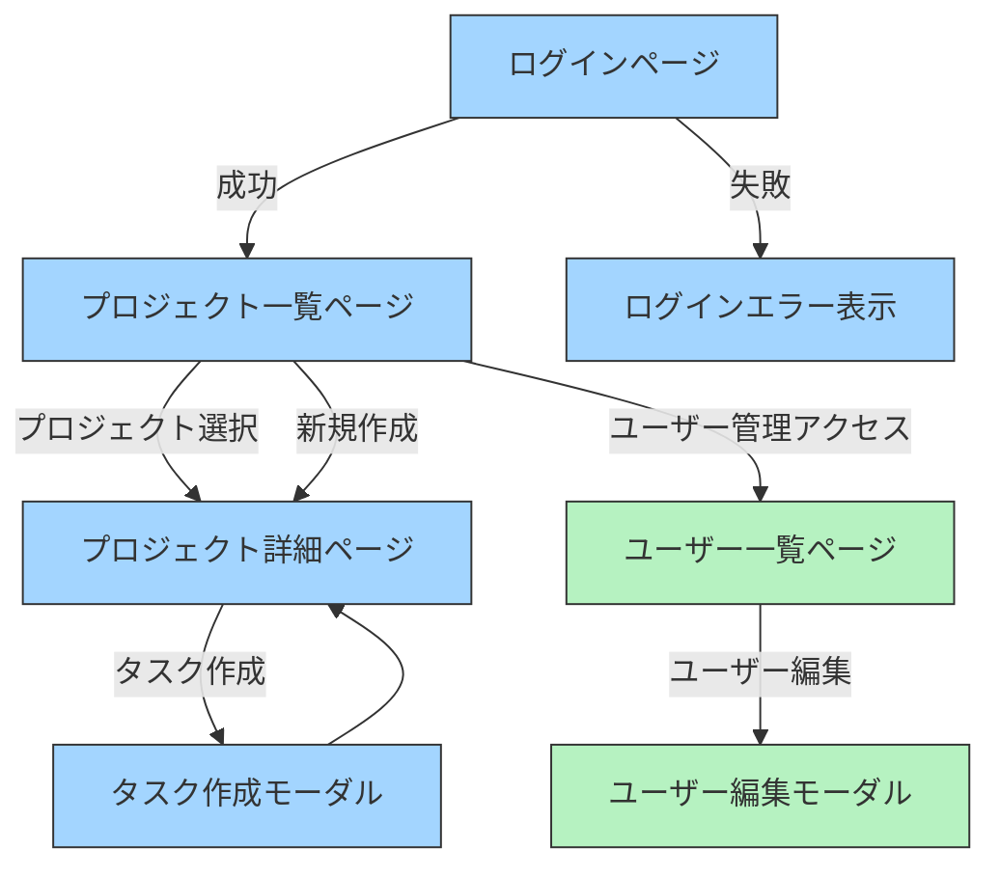

# UIデザイン

## 画面遷移図

※MVP画面は水色、後続画面は薄緑

```mermaid
flowchart TD
    classDef mvp fill:#a3d5ff,stroke:#333,stroke-width:1px;
    classDef later fill:#b6f2c1,stroke:#333,stroke-width:1px;

    %% 画面
    Login[ログインページ]:::mvp
    Projects[プロジェクト一覧ページ]:::mvp
    ProjectDetail[プロジェクト詳細ページ]:::mvp
    TaskModal[タスク作成モーダル]:::mvp
    LoginError[ログインエラー表示]:::mvp

    Users[ユーザー一覧ページ]:::later
    UserEdit[ユーザー編集モーダル]:::later

    %% 遷移
    Login -->|成功| Projects
    Login -->|失敗| LoginError

    Projects -->|プロジェクト選択| ProjectDetail
    Projects -->|新規作成| ProjectDetail

    ProjectDetail -->|タスク作成| TaskModal
    TaskModal --> ProjectDetail

    Projects -->|ユーザー管理アクセス| Users
    Users -->|ユーザー編集| UserEdit
```
