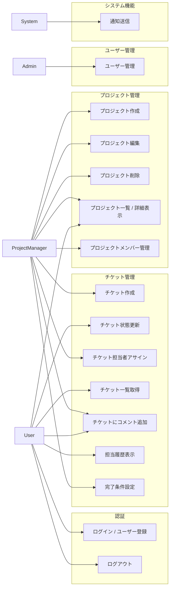

# ユースケース定義

```mermaid
graph LR
    %% アクター定義
    Admin["Admin"]
    PM["ProjectManager"]
    User["User"]
    System["System"]

    %% 認証
    subgraph Authenticate["認証"]
        Login["ログイン / ユーザー登録"]
        Logout["ログアウト"]
    end

    %% プロジェクト管理
    subgraph ProjectManagement["プロジェクト管理"]
        CreateProject["プロジェクト作成"]
        EditProject["プロジェクト編集"]
        DeleteProject["プロジェクト削除"]
        ViewProject["プロジェクト一覧 / 詳細表示"]
        ManageMember["プロジェクトメンバー管理"]
    end

    %% チケット管理
    subgraph TicketManagement["チケット管理"]
        CreateTicket["チケット作成"]
        UpdateTicketStatus["チケット状態更新"]
        AssignTicket["チケット担当者アサイン"]
        ViewTickets["チケット一覧取得"]
        AddComment["チケットにコメント追加"]
        ViewAssignmentHistory["担当履歴表示"]
        SetCompletionCriteria["完了条件設定"]
    end

    %% ユーザー管理
    subgraph UserManagement["ユーザー管理"]
        ManageUsers["ユーザー管理"]
    end

    %% 汎用システム
    subgraph SystemFunctions["システム機能"]
        Notify["通知送信"]
    end

    %% アクター → ユースケース
    User --> Login
    User --> Logout
    User --> ViewProject
    User --> ViewTickets
    User --> UpdateTicketStatus
    User --> ViewAssignmentHistory
    User --> AddComment

    PM --> CreateProject
    PM --> EditProject
    PM --> DeleteProject
    PM --> ViewProject
    PM --> CreateTicket
    PM --> AssignTicket
    PM --> SetCompletionCriteria
    PM --> AddComment
    PM --> ManageMember

    Admin --> ManageUsers

    System --> Notify
```
