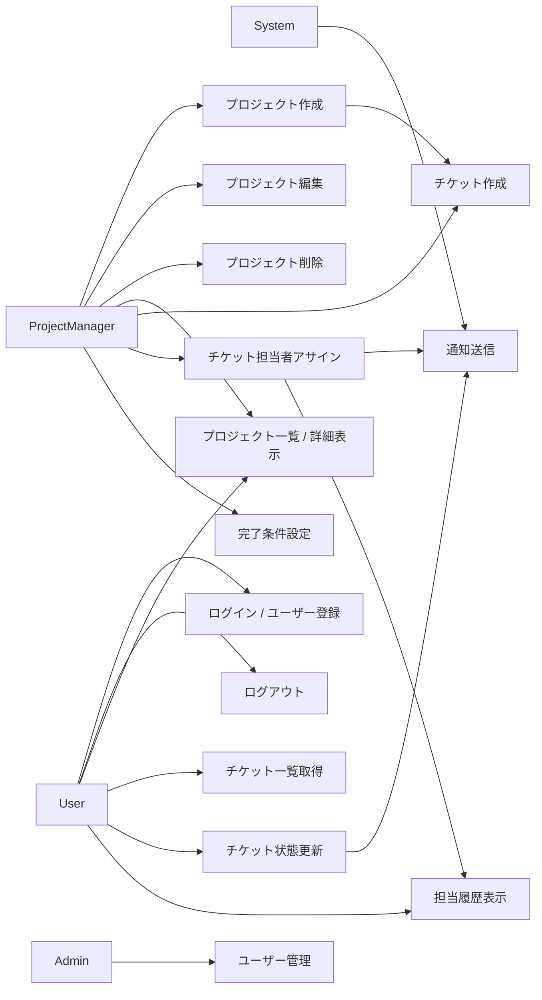

# ユースケース定義

```mermaid
graph LR
    %% アクター定義
    Admin["Admin"]
    PM["ProjectManager"]
    User["User"]
    System["System"]

    %% ユースケース定義
    Login["ログイン / ユーザー登録"]
    Logout["ログアウト"]
    CreateProject["プロジェクト作成"]
    EditProject["プロジェクト編集"]
    DeleteProject["プロジェクト削除"]
    ViewProject["プロジェクト一覧 / 詳細表示"]
    CreateTicket["チケット作成"]
    UpdateTicketStatus["チケット状態更新"]
    AssignTicket["チケット担当者アサイン"]
    ViewTickets["チケット一覧取得"]
    Notify["通知送信"]
    ViewAssignmentHistory["担当履歴表示"]
    SetCompletionCriteria["完了条件設定"]
    ManageUsers["ユーザー管理"]

    %% アクター → ユースケース
    User --> Login
    User --> Logout
    User --> ViewProject
    User --> ViewTickets
    User --> UpdateTicketStatus
    User --> ViewAssignmentHistory

    PM --> CreateProject
    PM --> EditProject
    PM --> DeleteProject
    PM --> ViewProject
    PM --> CreateTicket
    PM --> AssignTicket
    PM --> SetCompletionCriteria

    Admin --> ManageUsers

    System --> Notify

    %% 疑似 include / extend
    CreateProject --> CreateTicket
    AssignTicket --> Notify
    UpdateTicketStatus --> Notify
    AssignTicket --> ViewAssignmentHistory
```
