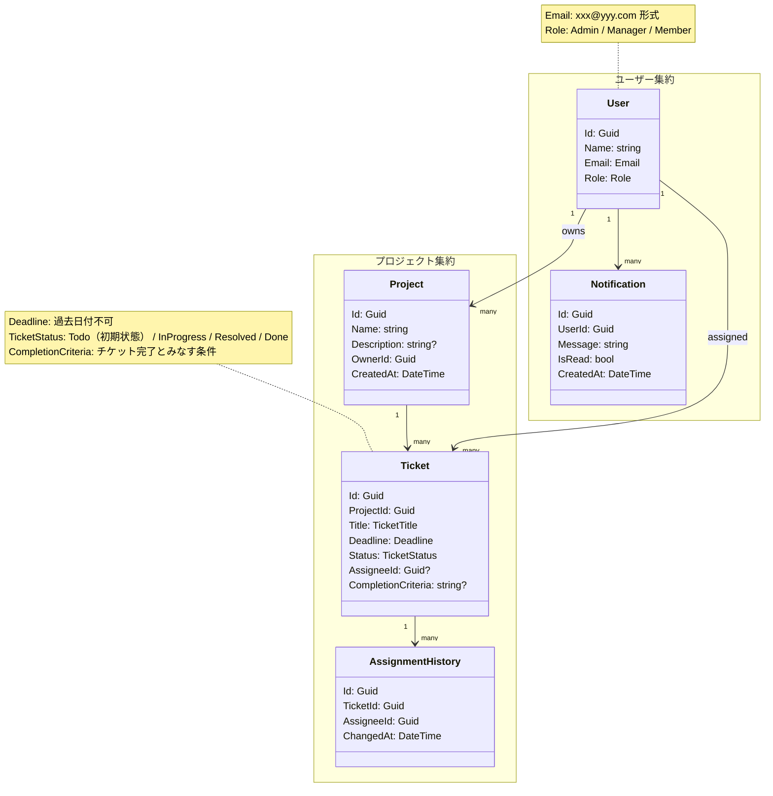

# ドメインモデル

```mermaid
classDiagram
  namespace ユーザー集約 {
    %% ユーザー
    class User {
      Id: Guid
      Name: string
      Email: Email
      Role: Role
    }

    %% 通知
    class Notification {
      Id: Guid
      UserId: Guid
      Message: string
      IsRead: bool
      CreatedAt: DateTime
    }
  }

  namespace プロジェクト集約 {
    %% プロジェクト
    class Project {
      Id: Guid
      Name: string
      Description: string?
      OwnerId: Guid
      CreatedAt: DateTime
    }

    %% チケット
    class Ticket {
      Id: Guid
      ProjectId: Guid
      Title: TicketTitle
      Deadline: Deadline
      Status: TicketStatus
      AssigneeId: Guid?
      CompletionCriteria: string?
    }

    %% 担当履歴
    class AssignmentHistory {
      Id: Guid
      TicketId: Guid
      AssigneeId: Guid
      ChangedAt: DateTime
    }
  }

  %% ドメインルール
  note for User "
  Email: xxx\@yyy.com 形式
  Role: Admin / Manager / Member
  "
  note for Ticket "
  Deadline: 過去日付不可
  TicketStatus: Todo（初期状態） / InProgress /  Resolved / Done
  CompletionCriteria: チケット完了とみなす条件
  "

  %% 関連
  User "1" --> "many" Project : owns
  Project "1" --> "many" Ticket
  User "1" --> "many" Ticket : assigned
  Ticket "1" --> "many" AssignmentHistory
  User "1" --> "many" Notification
```
