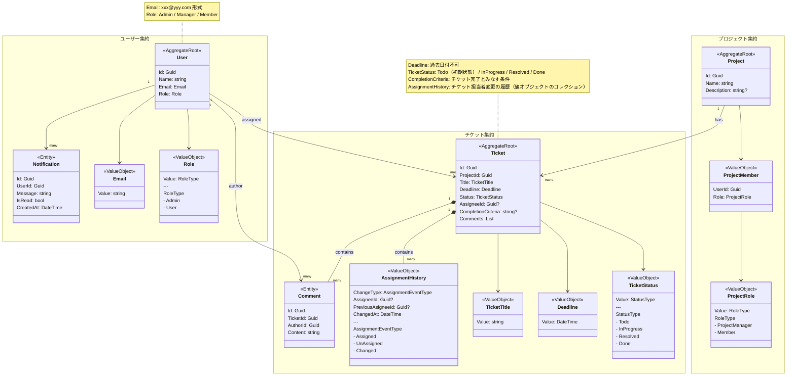

# ドメインモデル

```mermaid
classDiagram
  namespace ユーザー集約 {
    %% ユーザー
    class User {
      <<AggregateRoot>>
      Id: Guid
      Name: string
      Email: Email
      Role: Role
    }

    %% 通知
    class Notification {
      <<Entity>>
      Id: Guid
      UserId: Guid
      Message: string
      IsRead: bool
      CreatedAt: DateTime
    }

    %% 値オブジェクト
    class Email {
      <<ValueObject>>
      Value: string
    }
    class Role {
      <<ValueObject>>
      Value: RoleType
      ---
      RoleType
      - Admin
      - User
    }
  }

  namespace プロジェクト集約 {
    %% プロジェクト
    class Project {
      <<AggregateRoot>>
      Id: Guid
      Name: string
      Description: string?
    }

    %% 値オブジェクト
    class ProjectMember {
      <<ValueObject>>
      UserId: Guid
      Role: ProjectRole
    }
    class ProjectRole {
      <<ValueObject>>
      Value: RoleType
      RoleType
      - ProjectManager
      - Member
    }
  }

  namespace チケット集約 {
    %% チケット
    class Ticket {
      <<AggregateRoot>>
      Id: Guid
      ProjectId: Guid
      Title: TicketTitle
      Deadline: Deadline
      Status: TicketStatus
      AssigneeId: Guid?
      CompletionCriteria: string?
      Comments: List<Comment>
    }

    %% コメント
    class Comment {
      <<Entity>>
      Id: Guid
      TicketId: Guid
      AuthorId: Guid
      Content: string
    }

    %% 担当履歴
    class AssignmentHistory {
      <<ValueObject>>
      ChangeType: AssignmentEventType
      AssigneeId: Guid?
      PreviousAsigneeId: Guid?
      ChangedAt: DateTime
      ---
      AssignmentEventType
      - Assigned
      - UnAssigned
      - Changed
    }

    %% 値オブジェクト
    class TicketTitle {
      <<ValueObject>>
      Value: string
    }
    class Deadline {
      <<ValueObject>>
      Value: DateTime
    }
    class TicketStatus {
      <<ValueObject>>
      Value: StatusType
      ---
      StatusType
      - Todo
      - InProgress
      - Resolved
      - Done
    }
  }

  %% ドメインルール
  note for User "
  Email: xxx@yyy.com 形式
  Role: Admin / Manager / Member
  "
  note for Ticket "
  Deadline: 過去日付不可
  TicketStatus: Todo（初期状態） / InProgress /  Resolved / Done
  CompletionCriteria: チケット完了とみなす条件
  AssignmentHistory: チケット担当者変更の履歴（値オブジェクトのコレクション）
  "

  %% 関連
  Project "1" --> "many" Ticket : has
  User "1" --> "many" Ticket : assigned
  Ticket "1" *-- "many" Comment : contains
  User "1" --> "many" Comment : author
  Ticket "1" *-- "many" AssignmentHistory : contains
  User "1" --> "many" Notification

  %% 値オブジェクトの使用関係
  User --> Email
  User --> Role
  Project --> ProjectMember
  ProjectMember --> ProjectRole
  Ticket --> TicketTitle
  Ticket --> Deadline
  Ticket --> TicketStatus
```
