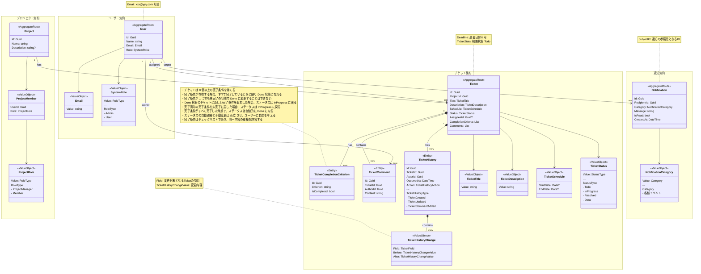

# ドメインモデル

```mermaid
classDiagram
  namespace ユーザー集約 {
    %% ユーザー
    class User {
      <<AggregateRoot>>
      Id: Guid
      Name: string
      Email: Email
      Role: SystemRoke
    }

    %% 値オブジェクト
    class Email {
      <<ValueObject>>
      Value: string
    }
    class SystemRole {
      <<ValueObject>>
      Value: RoleType
      ---
      RoleType
      - Admin
      - User
    }
  }

  namespace プロジェクト集約 {
    %% プロジェクト
    class Project {
      <<AggregateRoot>>
      Id: Guid
      Name: string
      Description: string?
    }

    %% 値オブジェクト
    class ProjectMember {
      <<ValueObject>>
      UserId: Guid
      Role: ProjectRole
    }
    class ProjectRole {
      <<ValueObject>>
      Value: RoleType
      RoleType
      - ProjectManager
      - Member
    }
  }

  namespace チケット集約 {
    %% チケット
    class Ticket {
      <<AggregateRoot>>
      Id: Guid
      ProjectId: Guid
      Title: TicketTitle
      Description: TicketDescription
      Schedule: TicketSchedule
      Status: TicketStatus
      AssigneeId: Guid?
      CompletionCriteria: List<TicketCompletioinCriterion>
      Comments: List<TicketComment>
    }

    %% チケット完了条件
    class TicketCompletionCriterion {
      <<Entity>>
      Id: Guid
      Criterion: string
      IsCompleted: bool
    }

    %% チケットコメント
    class TicketComment {
      <<Entity>>
      Id: Guid
      TicketId: Guid
      AuthorId: Guid
      Content: string
    }

    %% チケット操作履歴
    class TicketHistory {
      <<Entity>>
      Id: Guid
      TicketId: Guid
      ActorId: Guid
      OccurredAt: DateTime
      Action: TicketHistoryAction
      ---
      TicketHistoryType
      - TicketCreated
      - TicketUpdated
      - TicketCommentAdded
    }


    %% 値オブジェクト
    %% チケットタイトル
    class TicketTitle {
      <<ValueObject>>
      Value: string
    }
    %% チケット説明
    class TicketDescription {
      <<ValueObject>>
      Value: string
    }
    %% チケットスケジュール
    class TicketSchedule {
      <<ValueObject>>
      StartDate: Date?
      EndDate: Date?
    }
    %% チケットステータス
    class TicketStatus {
      <<ValueObject>>
      Value: StatusType
      ---
      StatusType
      - Todo
      - InProgress
      - Resolved
      - Done
    }
    %% チケット操作履歴内容
    class TicketHistoryChange {
      <<ValueObject>>
      Field: TicketField
      Before: TicketHistoryChangeValue
      After: TicketHistoryChangeValue
    }
  }

  namespace 通知集約 {
    %% 通知
    class Notification {
      <<AggregateRoute>>
      Id: Guid
      RecipientId: Guid
      Category: NotificationCategory
      Message: string
      IsRead: bool
      CreatedAt: DateTime
    }

    %% 値オブジェクト
    class NotificationCategory {
      <<ValueObject>>
      Value: Category
      ---
      Category
      - 各種イベント
    }
  }

  %% ドメインルール
  note for User "
  Email: xxx@yyy.com 形式
  "
  note for Ticket "
  Deadline: 過去日付不可
  TicketStats: 初期状態 Todo
  "
  note for TicketCompletionCriterion "
  ・チケットは 0 個以上の完了条件を持てる
  ・完了条件が存在する場合、すべて完了しているときに限り Done 状態になれる
  ・完了条件が 1 つでも未完了の状態で Done に変更することはできない
  ・Done 状態のチケットに新しい完了条件を追加した場合、ステータスは InProgress に戻る
  ・完了済みの完了条件を未完了に戻した場合、ステータスは InProgress に戻る
  ・完了条件がすべて完了した時点で、ステータスは自動的に Done になる
  ・ステータスの自動遷移と手動変更は 両立 させ、ユーザーに自由を与える
  ・完了条件はチェックリストであり、同一内容の重複を許容する
  "
  note for TicketHistoryChange "
  Field: 変更対象となるTicketの項目
  TicketHistoryChangeValue: 変更内容
  "
  note for Notification "
  SubjectId: 通知の参照元となるID
  "

  %% 関連
  Project "1" --> "many" Ticket : has
  User "1" --> "many" Ticket : assigned
  Ticket "1" *-- "many" TicketCompletionCriterion : has
  Ticket "1" *-- "many" TicketComment : contains
  User "1" --> "many" TicketComment : author
  Ticket "1" *-- "many" TicketHistory : has
  TicketHistory "1" *-- "many" TicketHistoryChange : contains
  User "1" --> "many" Notification : target

  %% 値オブジェクトの使用関係
  User --> Email
  User --> SystemRole
  Project --> ProjectMember
  ProjectMember --> ProjectRole
  Ticket --> TicketTitle
  Ticket --> TicketDescription
  Ticket --> TicketSchedule
  Ticket --> TicketStatus
  Notification --> NotificationCategory
```
