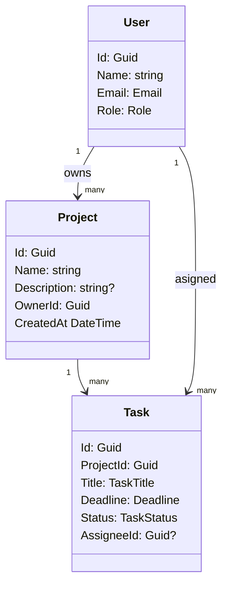

# ドメインモデル

## クラス図

```mermaid
classDiagram
  class User {
    Id: Guid
    Name: string
    Email: Email
    Role: Role
  }

  class Project {
    Id: Guid
    Name: string
    Description: string?
    OwnerId: Guid
    CreatedAt DateTime
  }

  class Task {
    Id: Guid
    ProjectId: Guid
    Title: TaskTitle
    Deadline: Deadline
    Status: TaskStatus
    AssigneeId: Guid?
  }

  %% 関連
  User "1" --> "many" Project : owns
  Project "1" --> "many" Task
  User "1" --> "many" Task : asigned
```

## 値オブジェクト

- Email: `xxx@yyy.com` 形式
- TaskTitle: 1～100文字以内
- Deadline: 過去日付不可
