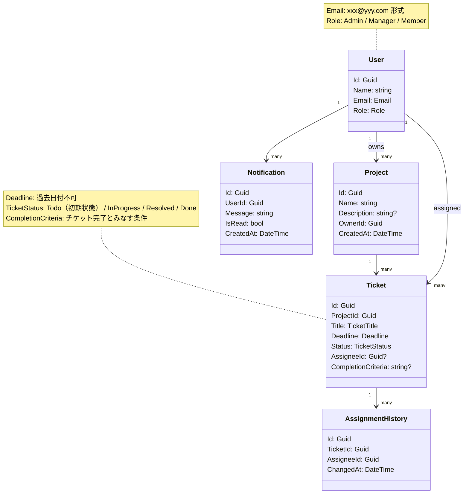

# ドメインモデル

```mermaid
classDiagram
  %% ユーザー
  class User {
    Id: Guid
    Name: string
    Email: Email
    Role: Role
  }
  note for User "
  Email: xxx\@yyy.com 形式
  Role: Admin / Manager / Member
  "

  %% プロジェクト
  class Project {
    Id: Guid
    Name: string
    Description: string?
    OwnerId: Guid
    CreatedAt: DateTime
  }

  %% チケット
  class Ticket {
    Id: Guid
    ProjectId: Guid
    Title: TicketTitle
    Deadline: Deadline
    Status: TicketStatus
    AssigneeId: Guid?
    CompletionCriteria: string?
  }
  note for Ticket "
  Deadline: 過去日付不可
  TicketStatus: Todo（初期状態） / InProgress / Resolved / Done
  CompletionCriteria: チケット完了とみなす条件
  "

  %% 担当履歴
  class AssignmentHistory {
    Id: Guid
    TicketId: Guid
    AssigneeId: Guid
    ChangedAt: DateTime
  }

  %% 通知
  class Notification {
    Id: Guid
    UserId: Guid
    Message: string
    IsRead: bool
    CreatedAt: DateTime
  }

  %% 関連
  User "1" --> "many" Project : owns
  Project "1" --> "many" Ticket
  User "1" --> "many" Ticket : assigned
  Ticket "1" --> "many" AssignmentHistory
  User "1" --> "many" Notification
```
