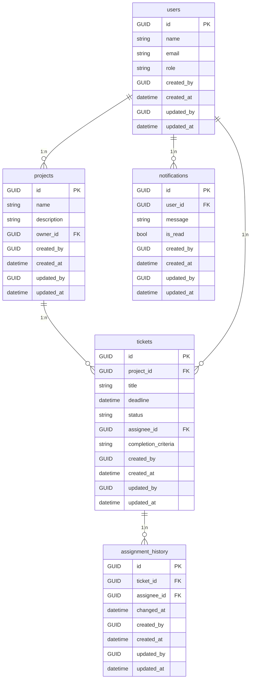

# ER図

```mermaid
erDiagram
    users {
        GUID id PK
        string name
        string email
        string role
        GUID created_by
        datetime created_at
        GUID updated_by
        datetime updated_at
    }
    projects {
        GUID id PK
        string name
        string description
        GUID owner_id FK
        GUID created_by
        datetime created_at
        GUID updated_by
        datetime updated_at
    }
    tickets {
        GUID id PK
        GUID project_id FK
        string title
        datetime deadline
        string status
        GUID assignee_id FK
        string completion_criteria
        GUID created_by
        datetime created_at
        GUID updated_by
        datetime updated_at
    }
    assignment_history {
        GUID id PK
        GUID ticket_id FK
        GUID assignee_id FK
        datetime changed_at
        GUID created_by
        datetime created_at
        GUID updated_by
        datetime updated_at
    }
    notifications {
        GUID id PK
        GUID user_id FK
        string message
        bool is_read
        GUID created_by
        datetime created_at
        GUID updated_by
        datetime updated_at
    }

    users ||--o{ projects : "1:n"
    projects ||--o{ tickets : "1:n"
    users ||--o{ tickets : "1:n"
    tickets ||--o{ assignment_history : "1:n"
    users ||--o{ notifications : "1:n"
```
