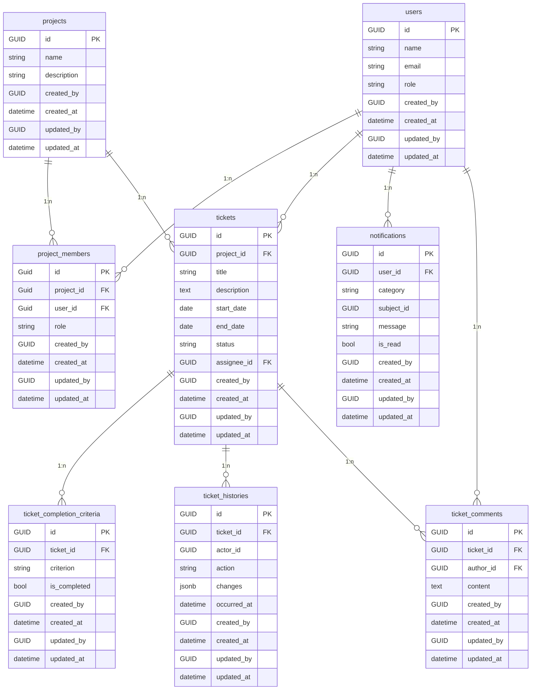

# ER図

```mermaid
erDiagram
    users {
        GUID id PK
        string name
        string email
        string role
        GUID created_by
        datetime created_at
        GUID updated_by
        datetime updated_at
    }
    projects {
        GUID id PK
        string name
        string description
        GUID created_by
        datetime created_at
        GUID updated_by
        datetime updated_at
    }
    project_members {
        Guid id PK
        Guid project_id FK
        Guid user_id FK
        string role
        GUID created_by
        datetime created_at
        GUID updated_by
        datetime updated_at
    }
    tickets {
        GUID id PK
        GUID project_id FK
        string title
        text description
        date start_date
        date end_date
        string status
        GUID assignee_id FK
        GUID created_by
        datetime created_at
        GUID updated_by
        datetime updated_at
    }
    ticket_completion_criteria {
        GUID id PK
        GUID ticket_id FK
        string criterion
        bool is_completed
        GUID created_by
        datetime created_at
        GUID updated_by
        datetime updated_at
    }
    ticket_comments {
        GUID id PK
        GUID ticket_id FK
        GUID author_id FK
        text content
        GUID created_by
        datetime created_at
        GUID updated_by
        datetime updated_at
    }
    ticket_histories {
        GUID id PK
        GUID ticket_id FK
        GUID actor_id
        string action
        jsonb changes
        datetime occurred_at
        GUID created_by
        datetime created_at
        GUID updated_by
        datetime updated_at
    }
    notifications {
        GUID id PK
        GUID user_id FK
        string category
        GUID subject_id
        string message
        bool is_read
        GUID created_by
        datetime created_at
        GUID updated_by
        datetime updated_at
    }

    users ||--o{ project_members : "1:n"
    projects ||--o{ project_members : "1:n"
    projects ||--o{ tickets : "1:n"
    users ||--o{ tickets : "1:n"
    tickets ||--o{ ticket_completion_criteria : "1:n"
    tickets ||--o{ ticket_histories : "1:n"
    users ||--o{ notifications : "1:n"
    tickets ||--o{ ticket_comments : "1:n"
    users ||--o{ ticket_comments : "1:n"
```
