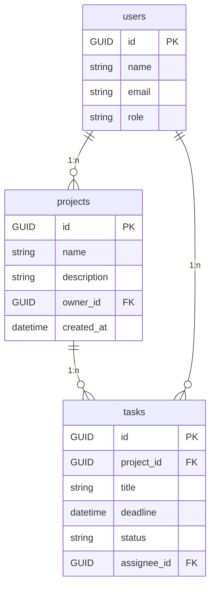

# ER図

```mermaid
erDiagram
    users {
        GUID id PK
        string name
        string email
        string role
    }
    projects {
        GUID id PK
        string name
        string description
        GUID owner_id FK
        datetime created_at
    }
    tasks {
        GUID id PK
        GUID project_id FK
        string title
        datetime deadline
        string status
        GUID assignee_id FK
    }

    users ||--o{ projects : "1:n"
    projects ||--o{ tasks : "1:n"
    users ||--o{ tasks : "1:n"
```
