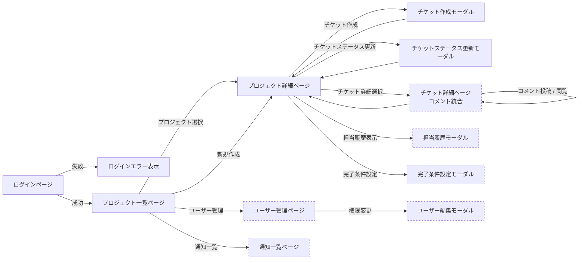

# UIデザイン

## 画面遷移図

```mermaid
flowchart LR
    %% クラス定義
    classDef mvp stroke-dasharray: 0;
    classDef later stroke-dasharray: 4;

    %% 認証系
    Login[ログインページ]:::mvp
    LoginError[ログインエラー表示]:::mvp

    %% プロジェクト系
    Projects[プロジェクト一覧ページ]:::mvp
    ProjectDetail[プロジェクト詳細ページ]:::mvp

    %% チケット系
    TicketModal[チケット作成モーダル]:::mvp
    TicketStatusUpdate[チケットステータス更新モーダル]:::mvp
    TicketDetail[チケット詳細ページ\nコメント統合]:::later
    AssignmentHistory[担当履歴モーダル]:::later
    CompletionCriteria[完了条件設定モーダル]:::later

    %% 管理系
    Users[ユーザー管理ページ]:::later
    UserEdit[ユーザー編集モーダル]:::later
    Notifications[通知一覧ページ]:::later

    %% 遷移
    Login -->|成功| Projects
    Login -->|失敗| LoginError

    Projects -->|プロジェクト選択| ProjectDetail
    Projects -->|新規作成| ProjectDetail

    ProjectDetail -->|チケット作成| TicketModal
    TicketModal --> ProjectDetail

    ProjectDetail -->|チケットステータス更新| TicketStatusUpdate
    TicketStatusUpdate --> ProjectDetail

    ProjectDetail -->|担当履歴表示| AssignmentHistory
    ProjectDetail -->|完了条件設定| CompletionCriteria

    ProjectDetail -->|チケット詳細選択| TicketDetail
    TicketDetail --> ProjectDetail
    TicketDetail -->|コメント投稿 / 閲覧| TicketDetail

    Projects -->|ユーザー管理| Users
    Users -->|権限変更| UserEdit

    Projects -->|通知一覧| Notifications
```
