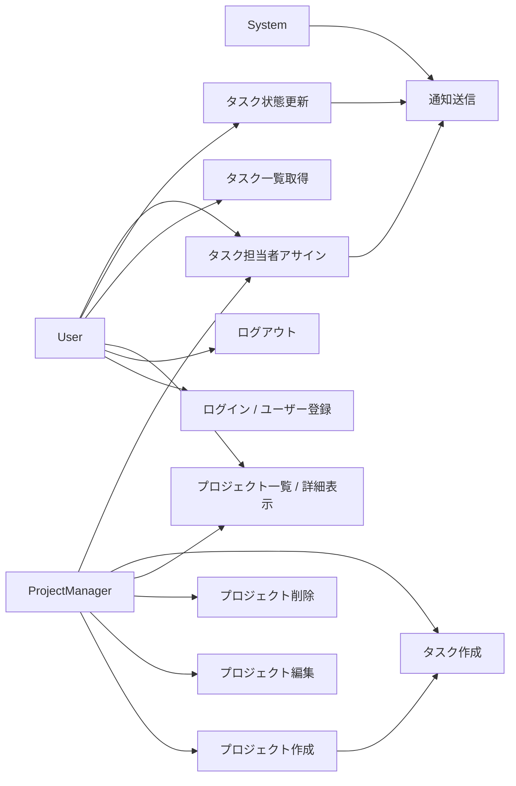

# ユースケース定義

```mermaid
graph LR
    %% アクター定義
    User["User"]
    PM["ProjectManager"]
    System["System"]

    %% ユースケース定義
    Login["ログイン / ユーザー登録"]
    Logout["ログアウト"]
    CreateProject["プロジェクト作成"]
    EditProject["プロジェクト編集"]
    DeleteProject["プロジェクト削除"]
    ViewProject["プロジェクト一覧 / 詳細表示"]
    CreateTask["タスク作成"]
    UpdateTaskStatus["タスク状態更新"]
    AssignTask["タスク担当者アサイン"]
    ViewTasks["タスク一覧取得"]
    Notify["通知送信"]

    %% アクター → ユースケース
    User --> Login
    User --> Logout
    User --> ViewProject
    User --> ViewTasks
    User --> UpdateTaskStatus
    User --> AssignTask

    PM --> CreateProject
    PM --> EditProject
    PM --> DeleteProject
    PM --> ViewProject
    PM --> CreateTask
    PM --> AssignTask

    System --> Notify

    %% 疑似 include / extend
    CreateProject --> CreateTask
    AssignTask --> Notify
    UpdateTaskStatus --> Notify
```
